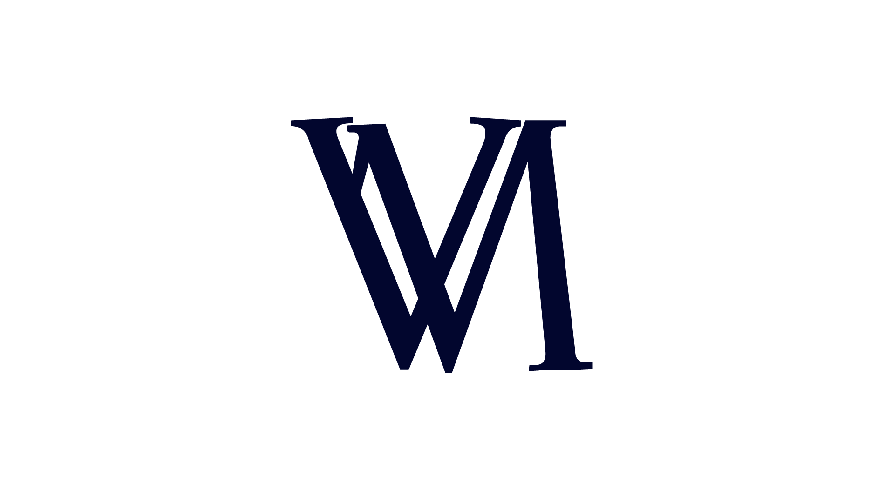

### **Founder · SaaS Builder · Accessibility Tech · AI & Product Strategy**

*Building digital products at the intersection of accessibility, artificial intelligence, education and business strategy.*

 

---

## About

I'm Vítor Magalhães — founder, product builder and strategist.

I build digital products for real problems: from SaaS tools for small businesses to AI-powered education systems and accessibility-first platforms. My work lives at the intersection of product thinking, business strategy and technical execution.

Founder of **[Access Platform](https://github.com/Vitt2909/accesssite-firebase)** — an accessibility-focused startup currently accelerated by **Samsung OceanLab** at EST/UEA, Manaus.  
Scholar at **Santander Imersão Digital**, Future Skills and AI track.

---

## Now

→ Building Access Platform through Samsung OceanLab #10 (Manaus, 2026)  
→ Developing an OCR-based answer sheet reader for real classroom use  
→ Freelancing web projects for B2B clients in Manaus  
→ Studying applied AI and digital strategy

---

## Pinned Projects

<table>
<tr>
<td width="50%">

### 🛍 BIPA
SaaS for small thrift stores and clothing shops to catalog products, build digital storefronts and sell through integrated payments (Stripe · Pix).

`SaaS` `E-commerce` `Payments`

`Status: privado`

</td>
<td width="50%">

### 🏟 Match Arena
Sports platform connecting players to arenas, open matches and local games — with a full ERP/dashboard for arena owners.

`Marketplace` `ERP` `Sports Tech`

`Status: privado`

</td>
</tr>
<tr>
<td width="50%">

### 📋 Answer Card Reader
Adaptable answer sheet reader that auto-detects custom card layouts and corrects them from scanned images. Built for a real school use case.

`Computer Vision` `OCR` `EdTech`

`Status: privado`

</td>
<td width="50%">

### 📚 Nexus Study OS
AI-powered study ecosystem: personalized schedules, learning paths, certificate management and free course discovery.

`AI` `Education` `Automation`

`Status: privado`

</td>
</tr>
<tr>
<td width="50%">

### 🎮 QuestCareer
Gamified career guidance platform that uses user decisions and AI to suggest professional paths for students.

`Gamification` `AI` `EdTech`

`Status: privado`

</td>
<td width="50%">

### ♿ Access Platform
Official startup platform focused on digital accessibility and inclusion, presenting projects, tools and content aligned with eMAG and WCAG standards.

`Accessibility` `Startup` `Social Tech`

`Status: em desenvolvimento` · [Ver repositório →](https://github.com/Vitt2909/accesssite-firebase)

</td>
</tr>
</table>

---

## Background

Founder of **Access Platform** · Samsung OceanLab #10 (2026)  
Freelance web dev · B2B clients, landing pages, dashboards and systems  
Santander Imersão Digital · Future Skills and AI track

---

## Tech Stack

---

> *Manaus is further from Silicon Valley than most people think.*  
> *That's exactly why I build here.*

---

